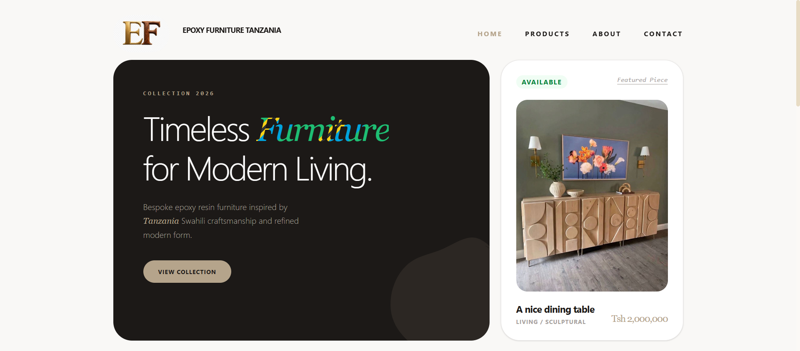
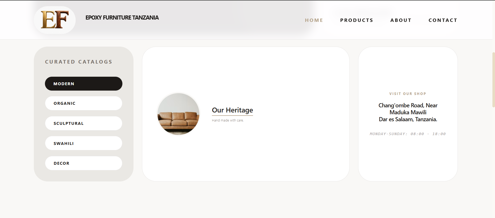
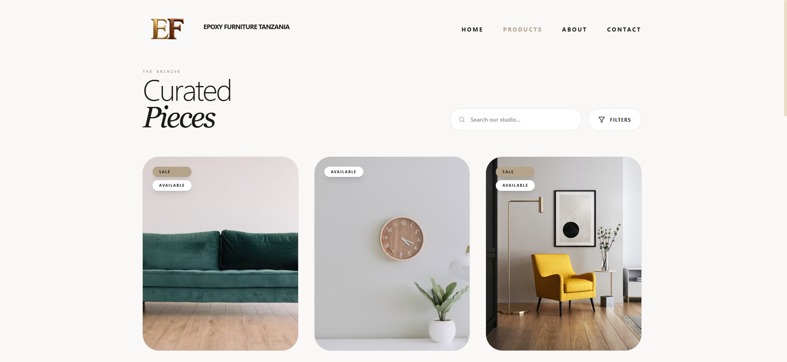
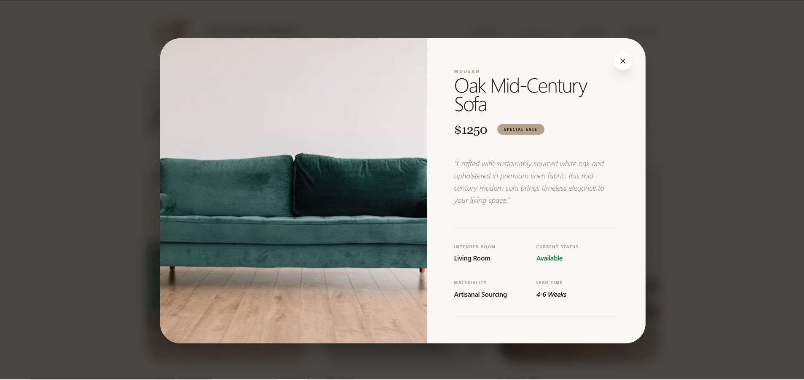
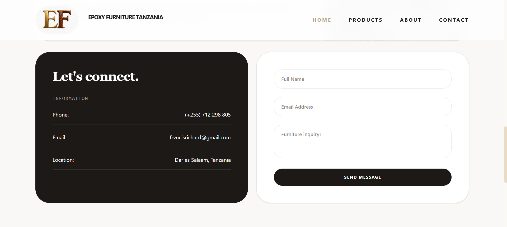
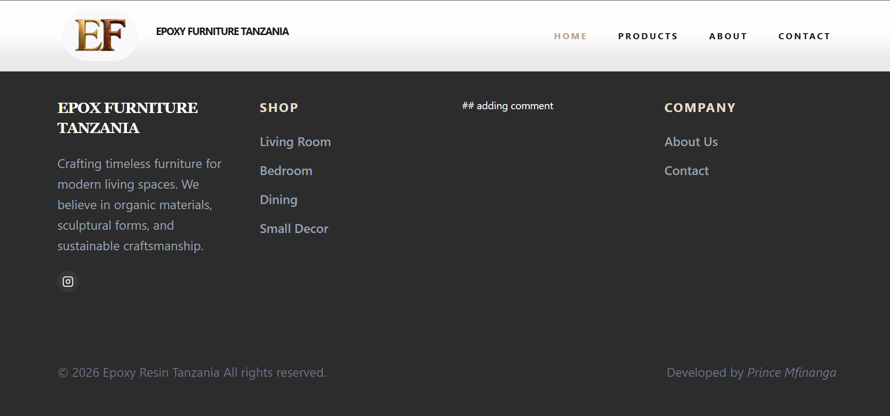

# Web Application Showcase

A modern web application designed to provide users with an intuitive interface for browsing products, viewing detailed product information, and contacting the business.

> **Note:** This repository is a visual showcase of the web application. The source code is not included.

## 📸 Application Preview

### 1. Home Page

The home page serves as the main landing page of the application. It introduces the website, highlights key content, and provides navigation to the main sections.



---

### 2. Second Page

This page provides additional information and content related to the application and its services.



---

### 3. Products Page

The products page allows users to browse the available products in an organized layout.



---

### 4. Product Details Page

The product details page provides more information about an individual product, allowing users to explore its features and other relevant details.



---

### 5. Contact Page

The contact page provides users with a way to get in touch and access relevant contact information.



---

### 6. Footer

The footer contains additional navigation links, contact information, and other supporting information available throughout the website.



---

## ✨ Features

* Responsive web interface
* Clean and user-friendly navigation
* Product browsing
* Individual product detail views
* Contact section
* Structured footer navigation
* Modern visual design
* Mobile-friendly layout

## 🗂️ Pages

| Page            | Description                                      |
| --------------- | ------------------------------------------------ |
| Home            | Main landing page                                |
| Second Page     | Additional website content                       |
| Products        | Product catalogue                                |
| Product Details | Detailed view of individual products             |
| Contact         | Contact and communication information            |
| Footer          | Additional navigation and supporting information |

## 🎯 Purpose

This repository serves as a **visual portfolio and demonstration** of the completed web application. Screenshots are provided to showcase the application's interface and user experience without exposing the underlying source code.

## 📁 Repository Structure

```text
.
├── README.md
└── screenshots/
    ├── home-page.png
    ├── second-page.png
    ├── products-page.png
    ├── product-details.png
    ├── contact-page.png
    └── footer.png
```

## 🛠️ Technology

The application was developed using React JS for the front-end and Django for the back-end.

## 👨‍💻 Author

**Prince Noah Mfinanga**

Data Scientist | Web Developer

---

⭐ If you find this project interesting, feel free to explore the repository and view the application screenshots.
